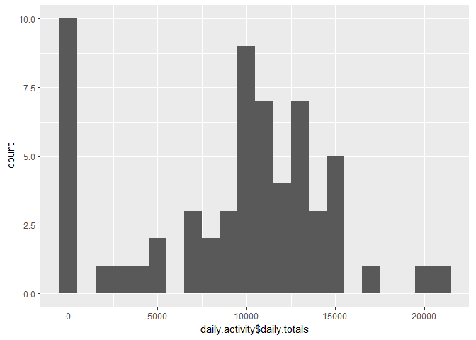
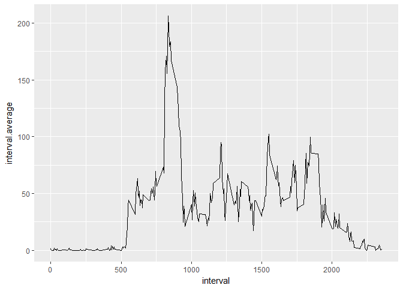
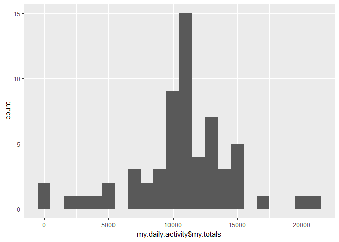
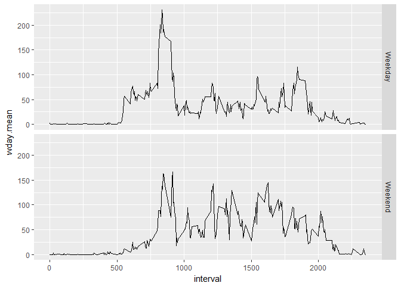

## Activity Monitoring Data

This assignment makes use of data from a personal activity monitoring device. This device collects data at 5 minute intervals through out the day. The data consists of two months of data from an anonymous individual collected during the months of October and November, 2012 and include the number of steps taken in 5 minute intervals each day.

The variables included in this dataset are:

* steps: Number of steps taking in a 5-minute interval (missing values are coded as NA)
* date: The date on which the measurement was taken in YYYY-MM-DD format
* interval: Identifier for the 5-minute interval in which measurement was taken

The dataset is stored in a comma-separated-value (CSV) file and there are a total of 17,568 observations in this dataset.

### Load required package libraries and set global options:


```r
library(knitr)
library(dplyr)
library(ggplot2)
library(lubridate)
opts_chunk$set(echo=TRUE)
```


### Loading and Preprocessing  the data

The following code loads and transforms the data into the necessary format for the analysis:


```r
activity <- read.csv("data/activity.csv", na.strings = "NA")
```

First we want to get an idea of what the data looks like:


```r
head(activity)
```

```
##   steps       date interval
## 1    NA 2012-10-01        0
## 2    NA 2012-10-01        5
## 3    NA 2012-10-01       10
## 4    NA 2012-10-01       15
## 5    NA 2012-10-01       20
## 6    NA 2012-10-01       25
```

```r
str(activity)
```

```
## 'data.frame':	17568 obs. of  3 variables:
##  $ steps   : int  NA NA NA NA NA NA NA NA NA NA ...
##  $ date    : Factor w/ 61 levels "2012-10-01","2012-10-02",..: 1 1 1 1 1 1 1 1 1 1 ...
##  $ interval: int  0 5 10 15 20 25 30 35 40 45 ...
```

The date is loaded as a factor variable so it needs to be changed into a "date" variable. We also change the steps variable to numeric.


```r
# Change date to date format 
activity$date <- as.Date(activity$date, format="%Y-%m-%d")
# Change steps to numeric
activity$steps <- as.numeric(activity$steps)
str(activity)
```

```
## 'data.frame':	17568 obs. of  3 variables:
##  $ steps   : num  NA NA NA NA NA NA NA NA NA NA ...
##  $ date    : Date, format: "2012-10-01" "2012-10-01" ...
##  $ interval: int  0 5 10 15 20 25 30 35 40 45 ...
```

### What is mean total number of steps taken per day?

For now, we will ignore the missing values in the dataset.

#### Total number of steps taken per day

First we calculate the total number of steps per day and  then make a histogram of the total number of steps taken each day


```r
# First group by date and then summarise by totals each day
daily.activity <- activity %>% group_by(date) %>% summarise(daily.totals=sum(steps, na.rm = T))
head(daily.activity)
```

```
## # A tibble: 6 x 2
##   date       daily.totals
##   <date>            <dbl>
## 1 2012-10-01            0
## 2 2012-10-02          126
## 3 2012-10-03        11352
## 4 2012-10-04        12116
## 5 2012-10-05        13294
## 6 2012-10-06        15420
```

```r
# Plot histogram of the data
qplot(daily.activity$daily.totals, binwidth=1000)
```

<!-- -->

#### Mean and median number of steps taken per day

Now we calculate the mean and median of the total number of steps taken each day:


```r
# Calculate and report mean and median
daily.mean <- mean(daily.activity$daily.totals, na.rm = T)
daily.median <- median(daily.activity$daily.totals, na.rm = T)
data.frame(activity.mean=daily.mean, activity.median=daily.median)
```

```
##   activity.mean activity.median
## 1       9354.23           10395
```

### What is the average daily activity pattern?

Now we make a time series plot (i.e. type = "l") of the 5-minute interval (x-axis) and the average number of steps taken, averaged across all days (y-axis)


```r
# Group by interval and then summarise using mean
interval.activity <- activity %>% group_by(interval) %>% summarise(interval.average=mean(steps, na.rm = T))
head(interval.activity)
```

```
## # A tibble: 6 x 2
##   interval interval.average
##      <int>            <dbl>
## 1        0           1.72  
## 2        5           0.340 
## 3       10           0.132 
## 4       15           0.151 
## 5       20           0.0755
## 6       25           2.09
```

```r
# Plot of 5-min interval and average number of steps across all days
qplot(x=interval, y=interval.average, data=interval.activity, geom="line")
```

<!-- -->

Which 5-minute interval, on average across all the days in the dataset, contains the maximum number of steps?


```r
# First find the max number of steps
max.avg.steps <- max(interval.activity$interval.average)
# Now find the interval that contains the max average steps 
interval.activity[interval.activity$interval.average==max.avg.steps,]
```

```
## # A tibble: 1 x 2
##   interval interval.average
##      <int>            <dbl>
## 1      835              206
```

So we can see that the interval with the largest number of steps is #835

### Inputting missing values

Calculate and report the total number of missing values in the dataset (i.e. the total number of rows with NAs)


```r
# We can sum the number of NA's
sum(is.na(activity))
```

```
## [1] 2304
```

Now we devise a strategy for filling in all of the missing values in the dataset. The strategy does not need to be sophisticated. We could use the mean/median for that day, or the mean for that 5-minute interval.

We will use the mean of the 5-min intervals to fill in the numbers of missing values:


```r
# First bind the columns from the activity and the average intervals data sets
my.activity <- cbind(activity, daily.avg=interval.activity$interval.average)
head(my.activity)
```

```
##   steps       date interval daily.avg
## 1    NA 2012-10-01        0 1.7169811
## 2    NA 2012-10-01        5 0.3396226
## 3    NA 2012-10-01       10 0.1320755
## 4    NA 2012-10-01       15 0.1509434
## 5    NA 2012-10-01       20 0.0754717
## 6    NA 2012-10-01       25 2.0943396
```

```r
# Now we can replace the NA's with the values from the interval average column
my.activity$steps <- ifelse(test = is.na(my.activity$steps),
                                yes = my.activity$daily.avg, 
                                no  = my.activity$steps)
head(my.activity)
```

```
##       steps       date interval daily.avg
## 1 1.7169811 2012-10-01        0 1.7169811
## 2 0.3396226 2012-10-01        5 0.3396226
## 3 0.1320755 2012-10-01       10 0.1320755
## 4 0.1509434 2012-10-01       15 0.1509434
## 5 0.0754717 2012-10-01       20 0.0754717
## 6 2.0943396 2012-10-01       25 2.0943396
```

Make a histogram of the total number of steps taken each day and Calculate and report the mean and median total number of steps taken per day. Do these values differ from the estimates from the first part of the assignment? What is the impact of imputing missing data on the estimates of the total daily number of steps?


```r
# First we find the total number of steps per day, grouping by day and then summarizing
my.daily.activity <- my.activity %>% group_by(date) %>% summarise(my.totals=sum(steps))
head(my.daily.activity)
```

```
## # A tibble: 6 x 2
##   date       my.totals
##   <date>         <dbl>
## 1 2012-10-01     10766
## 2 2012-10-02       126
## 3 2012-10-03     11352
## 4 2012-10-04     12116
## 5 2012-10-05     13294
## 6 2012-10-06     15420
```

```r
# Now we make a histogram of steps taken each day.
qplot(my.daily.activity$my.totals, binwidth=1000)
```

<!-- -->

```r
# Now we calculate the mean and median of total number of steps taken per day
my.daily.mean <- mean(my.daily.activity$my.totals)
my.daily.median <- median(my.daily.activity$my.totals)
data.frame(my.mean=my.daily.mean,my.median=my.daily.median)
```

```
##    my.mean my.median
## 1 10766.19  10766.19
```

So after inputting missing data, the mean and median have changed from before. Therefore having missing values introduced bias to the graph by reducing the mean and median of the data. Now the both the mean and median are equal after replacing missing values.

### Differences in activity patterns between weekdays and weekends

Now we create a new factor variable in the dataset with two levels - "weekday" and "weekend" indicating whether a given date is a weekday or weekend day


```r
# Here i make two columns, one for the day labels and another for the day numeber
my.activity.wkdays <- my.activity %>% 
        mutate(Weekday = wday(my.activity$date, label = T), 
               WdayNum = wday(my.activity$date)) %>%
        # Add a column with a conditional statement for weekday vs weekend
        mutate(W.Day = if_else(WdayNum >=2 & WdayNum <=6,"Weekday", "Weekend"))
head(my.activity.wkdays)
```

```
##       steps       date interval daily.avg Weekday WdayNum   W.Day
## 1 1.7169811 2012-10-01        0 1.7169811     Mon       2 Weekday
## 2 0.3396226 2012-10-01        5 0.3396226     Mon       2 Weekday
## 3 0.1320755 2012-10-01       10 0.1320755     Mon       2 Weekday
## 4 0.1509434 2012-10-01       15 0.1509434     Mon       2 Weekday
## 5 0.0754717 2012-10-01       20 0.0754717     Mon       2 Weekday
## 6 2.0943396 2012-10-01       25 2.0943396     Mon       2 Weekday
```

Now we make a panel plot containing a time series plot (i.e. type = "l") of the 5-minute interval (x-axis) and the average number of steps taken, averaged across all weekday days or weekend days (y-axis).


```r
# First we group by interval and then by Week day, then we summarise by obtaining the mean
interval.wday.activity <- my.activity.wkdays %>% 
        group_by(interval, W.Day) %>% 
        summarise(wday.mean=mean(steps))
# Takea a look at the outcome
head(interval.wday.activity)
```

```
## # A tibble: 6 x 3
## # Groups:   interval [3]
##   interval W.Day   wday.mean
##      <int> <chr>       <dbl>
## 1        0 Weekday    2.25  
## 2        0 Weekend    0.215 
## 3        5 Weekday    0.445 
## 4        5 Weekend    0.0425
## 5       10 Weekday    0.173 
## 6       10 Weekend    0.0165
```

```r
# Make a plot of the average steps per day on the weekends and weekdays for each interval
g <- ggplot(data=interval.wday.activity, aes(x=interval,y=wday.mean))
g + geom_line() + facet_grid(W.Day~.)
```

<!-- -->

